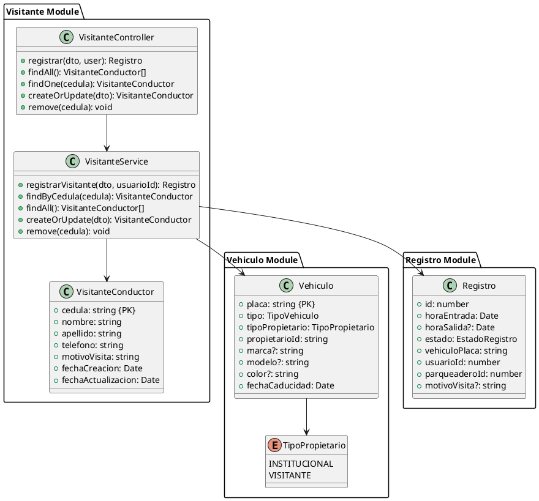

# Módulo de Visitantes

Sistema de registro de visitantes temporales para el sistema de parqueaderos CampusParking.

## 📋 Descripción

Este módulo permite registrar conductores visitantes (no institucionales) junto con sus vehículos y generar automáticamente el registro de entrada al parqueadero. Implementa una arquitectura de discriminador polimórfico para unificar el manejo de vehículos institucionales y de visitantes en una sola tabla.

## 🏗️ Arquitectura

### Patrón de Discriminador

El sistema utiliza un **discriminador de tipo de propietario** en la tabla `vehiculos`:

- **INSTITUCIONAL**: Vehículos de conductores en la tabla `conductores` (base de datos institucional, readonly)
- **VISITANTE**: Vehículos de visitantes temporales en la tabla `visitantes_conductores` (nuestra base de datos, CRUD completo)

### Entidades

#### VisitanteConductor
```typescript
{
  cedula: string;          // PK - Número de cédula
  nombre: string;
  apellido: string;
  telefono: string;
  motivoVisita: string;
  fechaCreacion: Date;
  fechaActualizacion: Date;
}
```

#### Modificaciones a Vehiculo
```typescript
{
  placa: string;           // PK
  tipo: TipoVehiculo;      // CARRO, MOTO, etc.
  tipoPropietario: TipoPropietario;  // INSTITUCIONAL o VISITANTE (discriminador)
  propietarioId: string;   // Código o cédula según tipoPropietario
  marca?: string;          // Opcional para visitantes
  modelo?: string;         // Opcional para visitantes
  color?: string;          // Opcional para visitantes
  fechaCaducidad: Date;    // Fecha de vencimiento del permiso
}
```

#### Modificaciones a Registro
```typescript
{
  // ... campos existentes
  motivoVisita?: string;   // Solo para visitantes
}
```

## 🚀 Instalación y Configuración

### 1. Ejecutar Migración de Base de Datos

```bash
psql -U postgres -d campus_parking -f database/migrations/001_agregar_soporte_visitantes.sql
```

La migración:
- ✅ Crea la tabla `visitantes_conductores`
- ✅ Agrega campos `tipo_propietario` y `propietario_id` a `vehiculos`
- ✅ Hace opcionales los campos `marca`, `modelo`, `color` en `vehiculos`
- ✅ Agrega campo `motivo_visita` a `registros`
- ✅ Migra datos existentes a `INSTITUCIONAL`
- ✅ Crea índices para optimizar búsquedas

### 2. Verificar Módulo Importado

El módulo ya está importado en `app.module.ts`:

```typescript
import { VisitanteModule } from './visitante/visitante.module';

@Module({
  imports: [
    // ... otros módulos
    VisitanteModule,
  ],
})
```

## 📡 API Endpoints

### Registrar Visitante Completo

**POST** `/visitantes/registrar`

Crea/actualiza conductor visitante, registra vehículo y genera entrada.

**Headers:**
```json
{
  "Authorization": "Bearer <token>"
}
```

**Roles permitidos:** VIGILANTE, ADMINISTRADOR, SUPERUSUARIO

**Body:**
```json
{
  "conductor": {
    "cedula": "1234567890",
    "nombre": "Juan",
    "apellido": "Pérez",
    "telefono": "3001234567",
    "motivoVisita": "Reunión académica"
  },
  "placa": "ABC123",
  "tipoVehiculo": "CARRO",
  "marca": "Toyota",
  "modelo": "Corolla",
  "color": "Rojo",
  "fechaCaducidad": "2025-11-20T23:59:59.000Z",
  "parqueaderoId": 1
}
```

**Response 201:**
```json
{
  "id": 123,
  "horaEntrada": "2025-11-20T14:30:00.000Z",
  "horaSalida": null,
  "estado": "ACTIVO",
  "vehiculoPlaca": "ABC123",
  "usuarioId": 1,
  "parqueaderoId": 1,
  "motivoVisita": "Reunión académica"
}
```

**Errores:**
- `400`: Fecha de caducidad vencida, pico y placa, parqueadero lleno
- `404`: Parqueadero no encontrado
- `409`: Vehículo ya registrado como institucional o con entrada activa

### Obtener Todos los Visitantes

**GET** `/visitantes`

**Roles permitidos:** ADMINISTRADOR, SUPERUSUARIO

**Response 200:**
```json
[
  {
    "cedula": "1234567890",
    "nombre": "Juan",
    "apellido": "Pérez",
    "telefono": "3001234567",
    "motivoVisita": "Reunión académica",
    "fechaCreacion": "2025-11-20T10:00:00.000Z",
    "fechaActualizacion": "2025-11-20T10:00:00.000Z"
  }
]
```

### Buscar Visitante por Cédula

**GET** `/visitantes/:cedula`

**Roles permitidos:** VIGILANTE, ADMINISTRADOR, SUPERUSUARIO

**Response 200:**
```json
{
  "cedula": "1234567890",
  "nombre": "Juan",
  "apellido": "Pérez",
  "telefono": "3001234567",
  "motivoVisita": "Reunión académica",
  "fechaCreacion": "2025-11-20T10:00:00.000Z",
  "fechaActualizacion": "2025-11-20T10:00:00.000Z"
}
```

**Error 404:**
```json
{
  "statusCode": 404,
  "message": "Visitante con cédula 1234567890 no encontrado"
}
```

### Crear/Actualizar Visitante

**POST** `/visitantes`

Permite gestionar datos de visitante sin crear registro de entrada.

**Roles permitidos:** ADMINISTRADOR, SUPERUSUARIO

**Body:**
```json
{
  "cedula": "1234567890",
  "nombre": "Juan",
  "apellido": "Pérez",
  "telefono": "3001234567",
  "motivoVisita": "Reunión académica"
}
```

### Eliminar Visitante

**DELETE** `/visitantes/:cedula`

**Roles permitidos:** ADMINISTRADOR, SUPERUSUARIO

**Response:** 204 No Content

## 🔄 Flujo de Registro Completo

El método `registrarVisitante()` ejecuta las siguientes validaciones en orden:

1. ✅ **Validar fecha de caducidad**: Debe ser futura
2. ✅ **Validar pico y placa**: Usando el servicio PicoPlacaService
3. ✅ **Validar capacidad**: Verificar que el parqueadero no esté lleno
4. ✅ **Crear/actualizar visitante**: En tabla `visitantes_conductores`
5. ✅ **Crear/actualizar vehículo**: Con `tipoPropietario = VISITANTE`
6. ✅ **Verificar registro activo**: No puede haber entrada duplicada
7. ✅ **Crear registro**: Generar entrada al parqueadero

## 🔍 Validaciones Implementadas

### Validación de Fecha de Caducidad
```typescript
if (fechaCaducidad <= ahora) {
  throw new BadRequestException(
    'La fecha de caducidad del permiso debe ser futura'
  );
}
```

### Validación de Pico y Placa
```typescript
const validacion = await this.picoPlacaService.validarPicoPlaca({
  placa: dto.placa,
  fechaHora: ahora.toISOString(),
});

if (validacion.tieneRestriccion) {
  throw new BadRequestException(
    `No puede ingresar por restricción de pico y placa: ${validacion.mensaje}`
  );
}
```

### Validación de Capacidad
```typescript
const registrosActivos = await this.registroRepository.count({
  where: { parqueaderoId, horaSalida: null },
});

if (registrosActivos >= parqueadero.capacidad) {
  throw new BadRequestException(
    `El parqueadero ${parqueadero.nombre} está lleno`
  );
}
```

### Prevención de Conflictos
```typescript
// No permitir que un vehículo institucional se registre como visitante
if (vehiculo.tipoPropietario === TipoPropietario.INSTITUCIONAL) {
  throw new ConflictException(
    `El vehículo con placa ${placa} ya está registrado como institucional`
  );
}

// No permitir registros duplicados activos
const registroActivo = await this.registroRepository.findOne({
  where: { vehiculoPlaca, horaSalida: null },
});

if (registroActivo) {
  throw new ConflictException(
    `El vehículo ya tiene un registro de entrada activo`
  );
}
```

## 🧪 Pruebas

### Crear Tests Unitarios

```bash
npm run test src/visitante/visitante.service.spec.ts
```

### Crear Tests E2E

```bash
npm run test:e2e test/visitante.e2e-spec.ts
```

## 📊 Diagrama de Clases



## 🔐 Seguridad

### Autenticación y Autorización

Todos los endpoints requieren:
- ✅ Token JWT válido (JwtAuthGuard)
- ✅ Rol apropiado (RolesGuard)

### Roles por Endpoint

| Endpoint | VIGILANTE | ADMINISTRADOR | SUPERUSUARIO |
|----------|-----------|---------------|--------------|
| POST /visitantes/registrar | ✅ | ✅ | ✅ |
| GET /visitantes | ❌ | ✅ | ✅ |
| GET /visitantes/:cedula | ✅ | ✅ | ✅ |
| POST /visitantes | ❌ | ✅ | ✅ |
| DELETE /visitantes/:cedula | ❌ | ✅ | ✅ |

## 📝 Consideraciones de Implementación

### Campos Opcionales en Vehículos

Los campos `marca`, `modelo` y `color` son opcionales para visitantes porque:
- Agiliza el proceso de registro en la caseta
- El vigilante puede no tener todos los datos del vehículo
- La placa es suficiente para identificación y validación de pico y placa

### Actualización Automática de Datos

Si un visitante regresa:
- Sus datos se actualizan automáticamente
- El vehículo se actualiza si cambió
- Se crea un nuevo registro de entrada

### Integridad Referencial

El sistema NO crea foreign keys explícitas entre:
- `vehiculos.propietarioId` → `conductores.codigo` (cuando INSTITUCIONAL)
- `vehiculos.propietarioId` → `visitantes_conductores.cedula` (cuando VISITANTE)

Esto es intencional porque:
- Son tablas de diferentes bases de datos lógicas
- TypeORM maneja la relación mediante el discriminador
- Evita problemas con la tabla `conductores` readonly

## 🔄 Rollback

Para revertir los cambios de la migración:

```bash
psql -U postgres -d campus_parking -f database/migrations/001_rollback_visitantes.sql
```

**⚠️ ADVERTENCIA:** El rollback eliminará:
- Tabla `visitantes_conductores`
- Campos `tipo_propietario` y `propietario_id` de `vehiculos`
- Campo `motivo_visita` de `registros`

## 📚 Documentación Relacionada

- [Módulo de Pico y Placa](../pico-placa/README.md)
- [Módulo de Registro](../registro/README.md)
- [Módulo de Vehículos](../vehiculo/README.md)
- [Diagrama de Clases Actualizado](../../diagrama-clases-actualizado.puml)

## 👥 Autores

- Backend Team - CampusParking
- Fecha: Noviembre 2025
